# TMY Globalization Plugin for Wordpress Getting Started & FAQ

----

TMY Globalization Plugin is an open source tool for internationalization and localization of Wordpress based websites. TMY Plugin provides two translation workflows:

* Live Translation workflow
* Full Professional Translation workflow

Live translation workflow provides instant translation based on Google Translate engine. Simply configure the extra languages you want to support through the intutuive setup interface and save, then you are done.

Full Professional workflow provides more control and higher translation quality, which involves extracting the text for translation, translating and integrating back into Wordpress. More specifically TMY plugin hosts your translations locally for proof reading, editing and final publication. You can intergrate machine translation of your choice to prepare your contents, then leveraging fully featured translation editor with any 3rd party translation agencies.

TMY Plugin provides multiple ways to handle different development phases of the Wordpress websites with intuitive and easy to use interfaces, some features include:

* Live Translation powered by Google Translate
* Full cycle to keep translation locally for proof read, edit and publish.
* Support new block Gutenberg editor and classic editor.
* Support Google Translate integration with editing capability
* Language switcher based on
  * Draggable floating meanu
  * Sidebar widget
  * Along with title or description
  * With any page or post
* Language switcher is in language name or flags
* Detect browser language setting
* Support browser cookie
* Premium service available
* Live support community

----

## Install and activate TMY Plugin 

<kbd>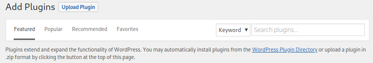</kbd>

Download the plugin zip file from https://github.com/tmysoft/tmy-wordpress/releases, e.g. tmy-globalization-1.0.0.zip 

Or, search the "TMY Globalization", install it, after successful installation, TMY Globalizaition main menu should appear in the Wordpress Dashboard as following:

<kbd>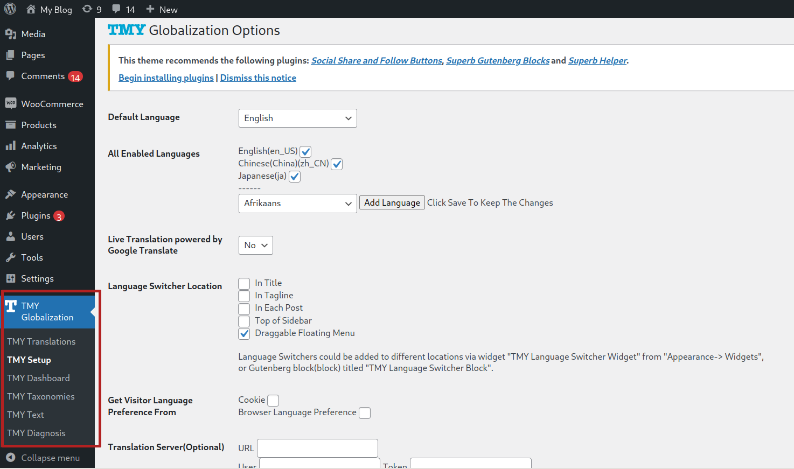</kbd>

Then, activate it.

## Configure TMY Plugin for Live Translation workflow

From the Wordpress dashboard side menu, TMY Globalization -> TMY setup:

<kbd>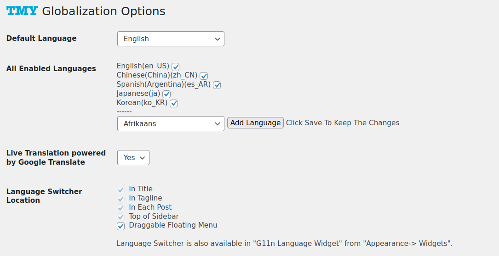</kbd>

Key configuration:
- Add the extra languages you want to support 
- Make sure the Live Translation powered by Google Translate is set to "Yes"
- Make sure Language Switcher Location is chose at "Draggable Floating Menu"

Press "Save Changes".

Visting your website, switching between languages to see how your website is being translated live.
<kbd>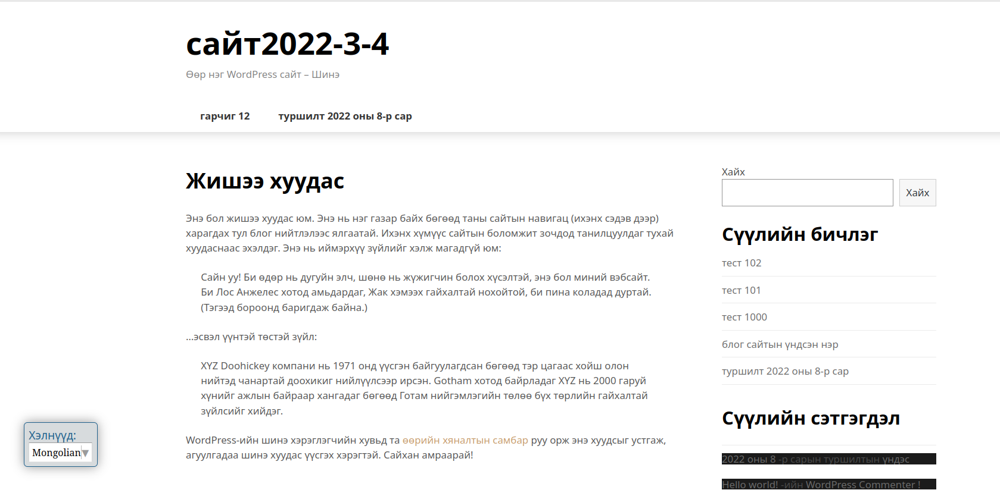</kbd>

## Configure TMY Plugin for Full Professional Translation workflow

From the Wordpress dashboard side menu, TMY Globalization -> TMY setup:

<kbd>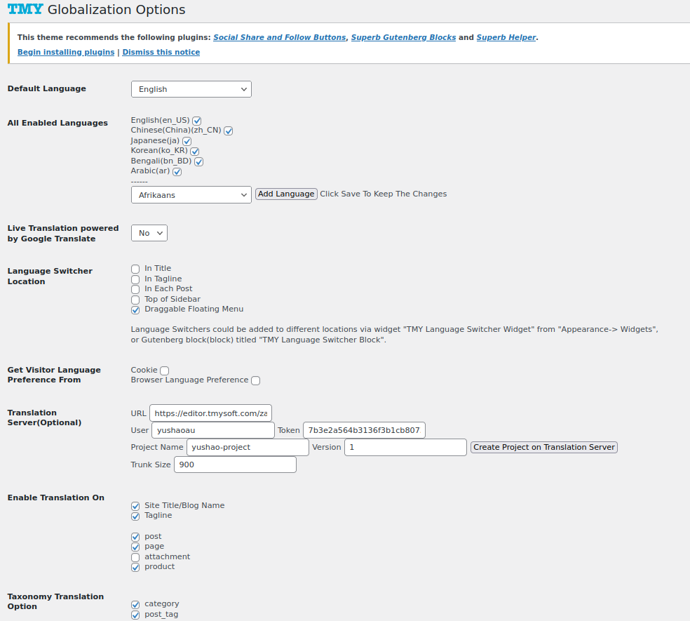</kbd>

Key configuration:
- Configure the additional enabled languages
- Do you enable translations on key properties: site title, tagline, posts and pages
- Language switcher location
- How do you want your language switcher to look like, just text or showing flags

Remember to save your changes

## Use TMY Plugin to translate Post, Page or other Custom Type

In addition to "Page" and "Post" two main native document types, TMY plugin can auto detect any custom build type of document on Wordpress, for example, for Woo Commerce, "product" is the main custom type. Visit the TMY Setup page, you should see "product" is listed, select the ones you want to translate, and click save to continue. 

<kbd>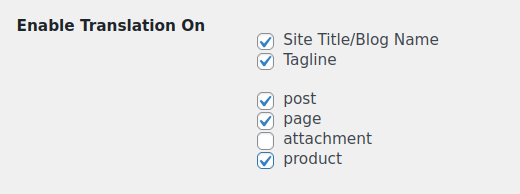</kbd>

There are two ways to start creating the translation page of a post or page.

### 1. From the main listing page of the Page of Post
From Admin Main Menu->"Pages" or "Posts", as in the following screenshot, select the post or posts, then select "Start or Sync translation" in the Bulk Action meanu, then click "Apply":

<kbd>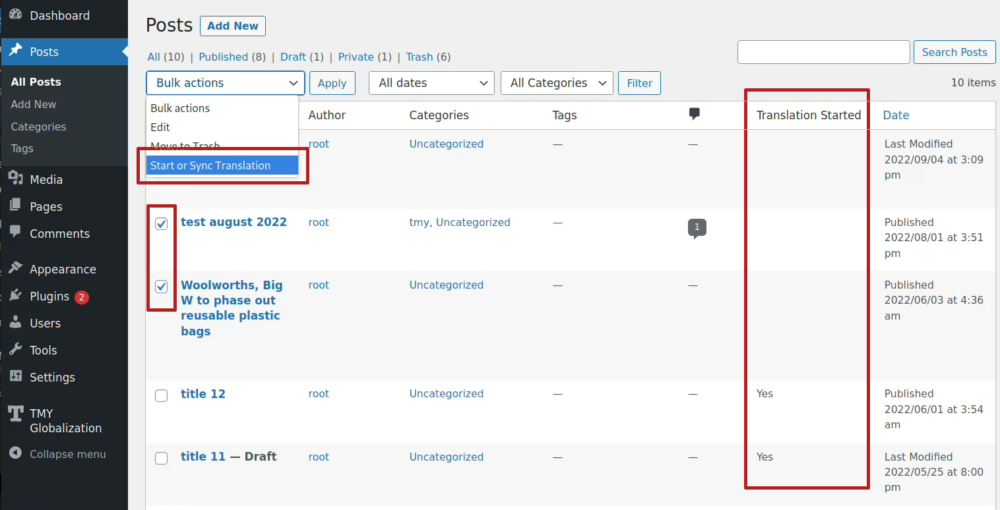</kbd>

You could check which page or post has started translation from the "Translation Started" column.

### 2. From the Edit page of individual Page or Post

Log into the Admin panel of wordpress, navigate to the post page you want to translate, click button 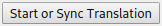

<kbd>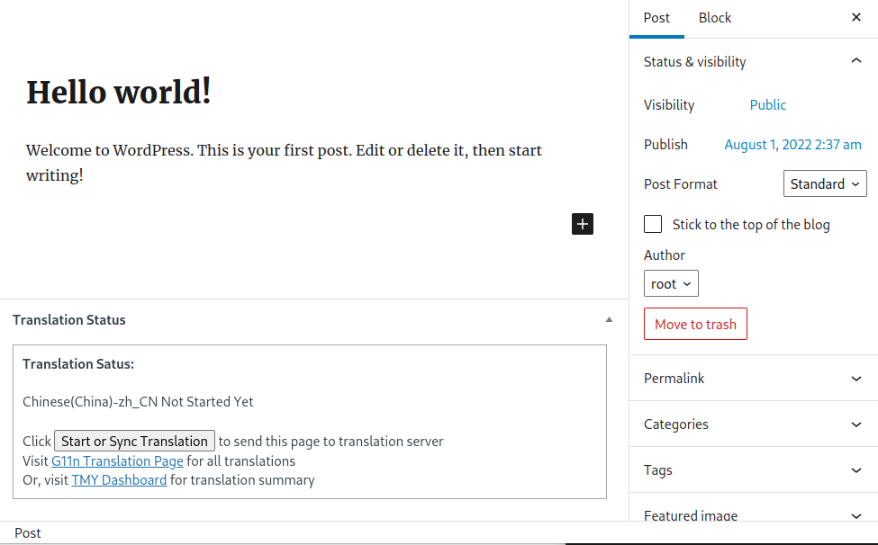</kbd>

Follow the information in the Translation Status box to get to the specific lanaguge translation page:

<kbd>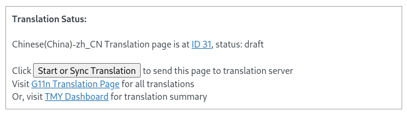</kbd>

Put the translation into the corresponding translation editor of the page or post, then Publish it. Make sure you see the green LIVE button

<kbd>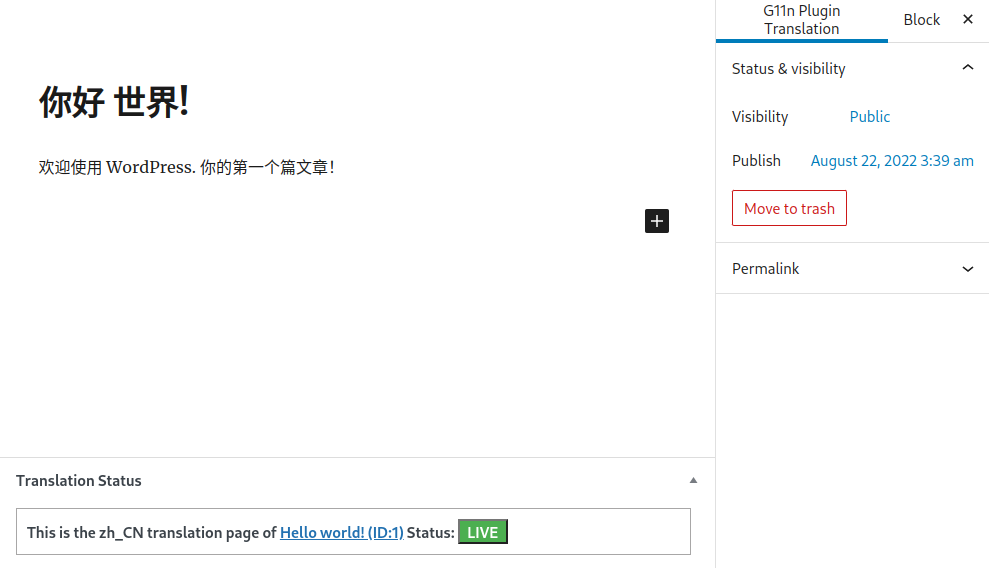</kbd>

## Use TMY Plugin to translate the site title or tagline 

Site title is also called blogname at some places, similarly, tage line is often being called blogdescription, you can configure or change them at Setting -> General menu:

<kbd></kbd>

To start translating them, enable the translation to them from TMY Globalization -> TMY Setup:

<kbd>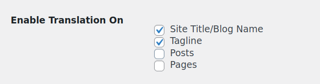</kbd>

Then the plugin will automatically create the place holder post corresponding to the blogname or blogdesription, the place holder post will be set as private. 

<kbd>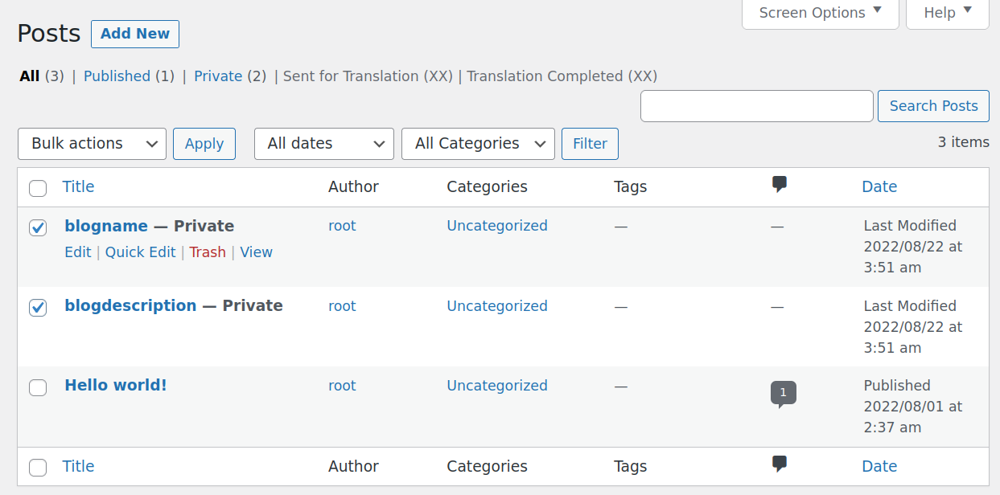</kbd>

Following the same way to translate the page or post to complete the translation.

## Use TMY Plugin For Taxonomies Translation(Categories, Tags, WooCommerces) 

TMY plugin will automatically detect all the taxonomy types including those from other themes or plugins, as shown in the following screen shots, enable as you need.

<kbd>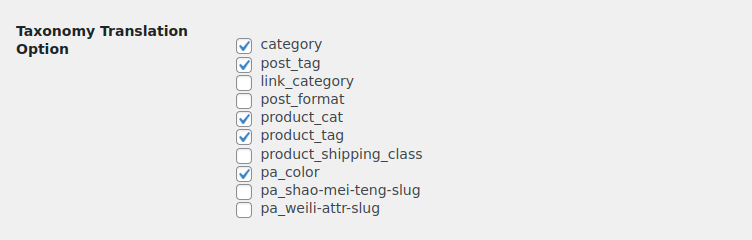</kbd>

Then visit TMY Globalization -> TMY Taxonomies page, to start translation, you can use bulk action or in the invidual Catgeories or Tags page to start individual setup page , then following the same steps as you tanslate Posts or Pages.

<kbd>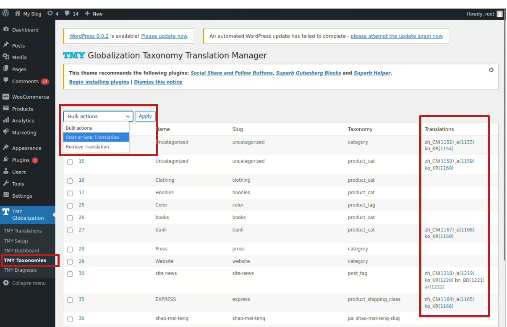</kbd>

Following the same way to translate the page or post to complete the translation.

## Translate Menu Labels and WooCommerce Product Attributes

Visit TMY Globalization -> TMY Text page, The plugin will automatically pick all the menu labels and WooCommerce product attributes as shown in the following screenshot.

Select the item or items, use "Sync or Sync Translation" bulk acitons to star the translation process. Just remember to keep title(e.g. "Color" ) unchanged. 

<kbd>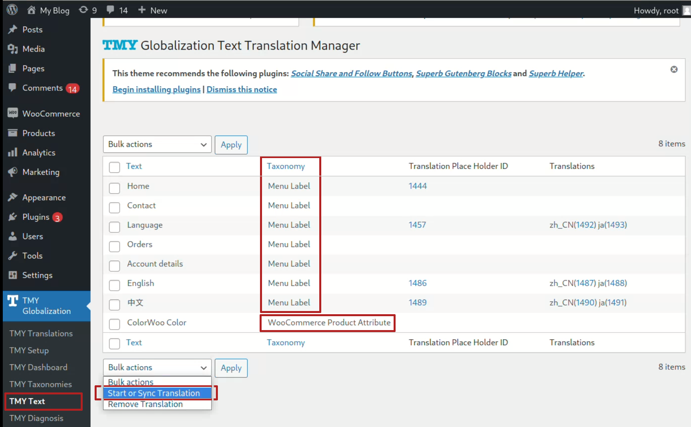</kbd>

Or create a private Post with the title the same as the Product attribute, then start translation as you do with normal Post, remember to keep it private, so it will not show up on your site. 

TMY plugin will pickup the translation following the string match("Color" to "Color") and use it for Woo Commerce product attribute translation.

<kbd>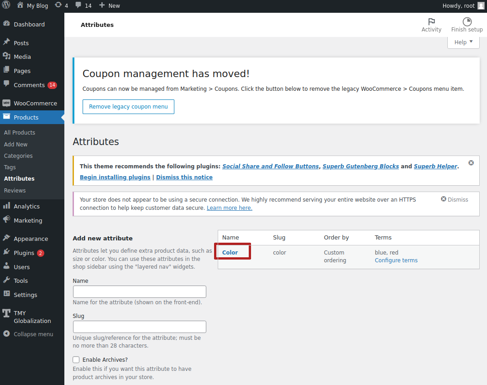</kbd>

<kbd>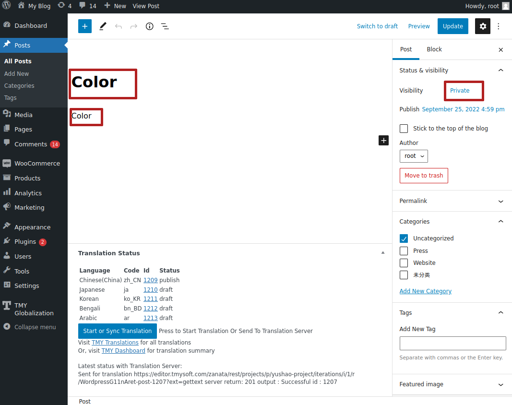</kbd>

## Translate Excerpt of Woo Commerce Product

Excerpt of a Woo Commerce product is used as brief introduction of the product, reference following screenshot to get it translated.

<kbd>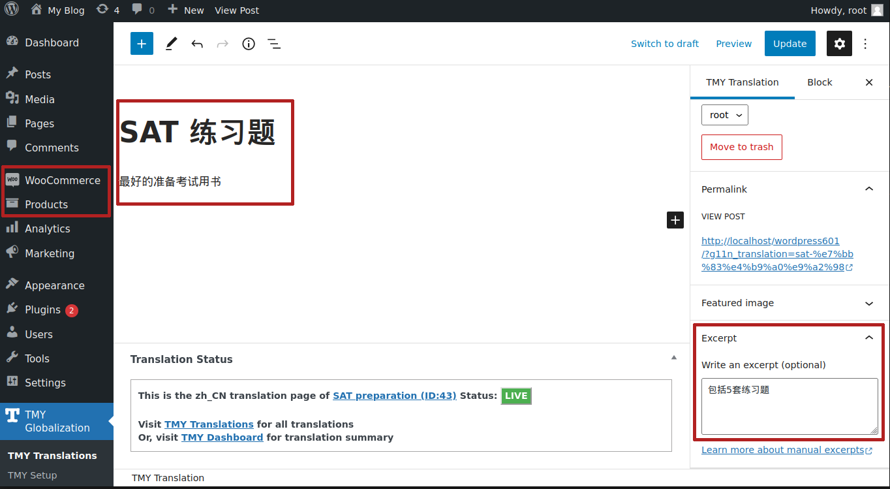</kbd>

## Configure the Language Swither

The plugin provides multiple way for website visitors to switch between different languages:

- TMY Language Switch Links for setting up Menus

  <kbd>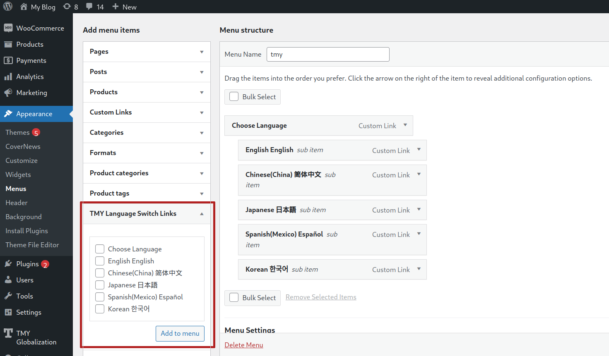</kbd>

  Somen menu links screenshots:

  <kbd>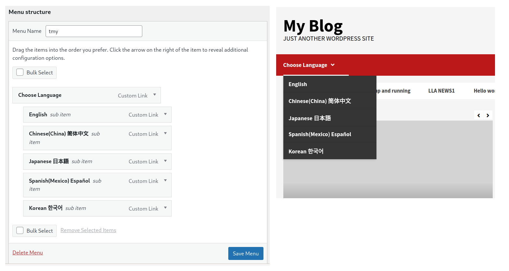</kbd>
  <kbd>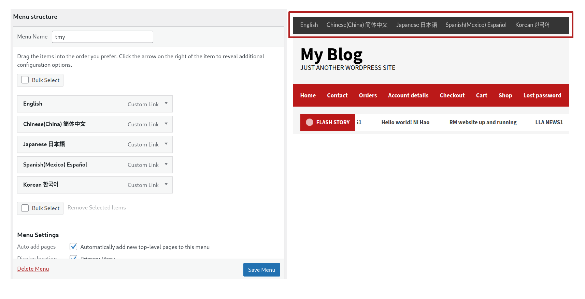</kbd>

- TMY Language Switcher Block

  <kbd>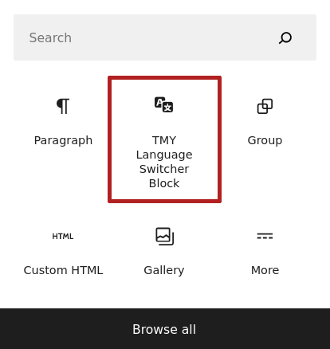</kbd>


- TMY Language Switcher Widget

  <kbd>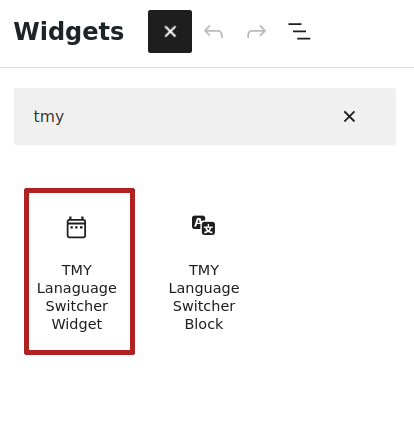</kbd>

The language switcher could be placed at predefined locations, in TMY Globalization -> TMY Setup, you can put it in:
1. In Title
2. In Tagline
3. Top of Sidebar
4. In Each Post
5. Draggable Floating Menu 

You might try to try to see which location is best fit in your website, here is the reference:

<kbd>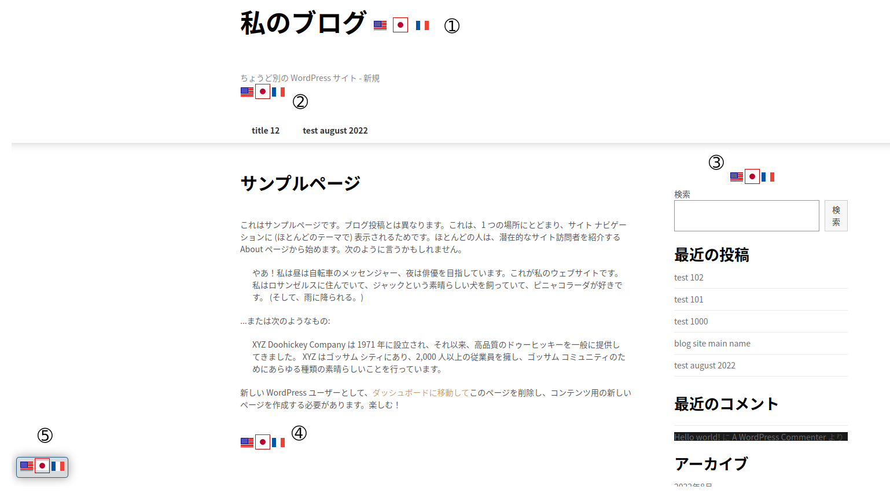</kbd>

## Using "TMY Translatiaon" & "TMY Dashboard"

"TMY Translation" page lists all the local translations, it lists:
- Title
- ID, the post id of the translation 
- Lanaguge
- Original ID, the post id of the original post/pages
- Translation Status, is the translation live viewable publicly
- Date, Last modified time

<kbd>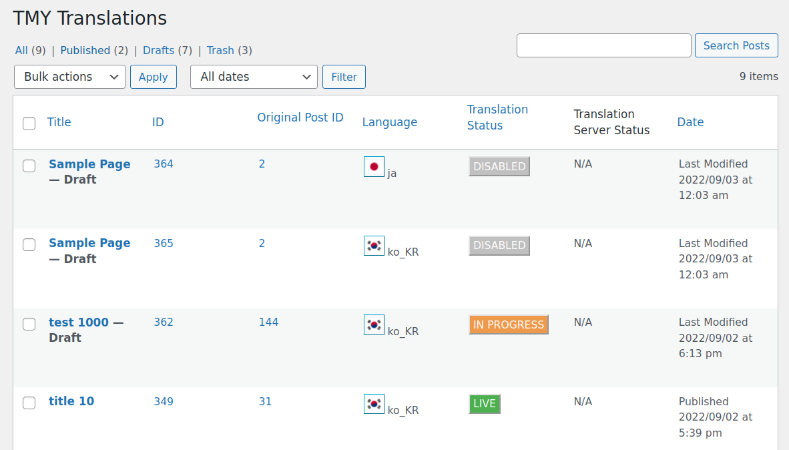</kbd>

"TMY Dashboard" provides a centralized place to pull translations from translation server.


## Using TMY Plugin Premium Service

TMY Premium is designed to help users do translation much easily, when the translation server is configured, contents will be pushed to translation server and editor automatically, machine translation automation is also provided for much easier integration. This diagram illustrates the work flow with free vs premium service.

<kbd>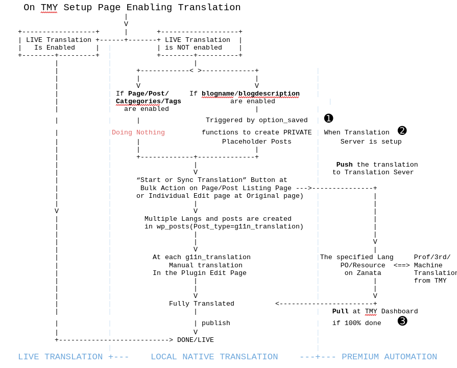</kbd>

## Configuration and use TMY Translation Editor(Premium Service)

Register with tmysoft.com, log into the TMY Web Editor/Zanata, create the API key. Create the project and version of your project.

<kbd>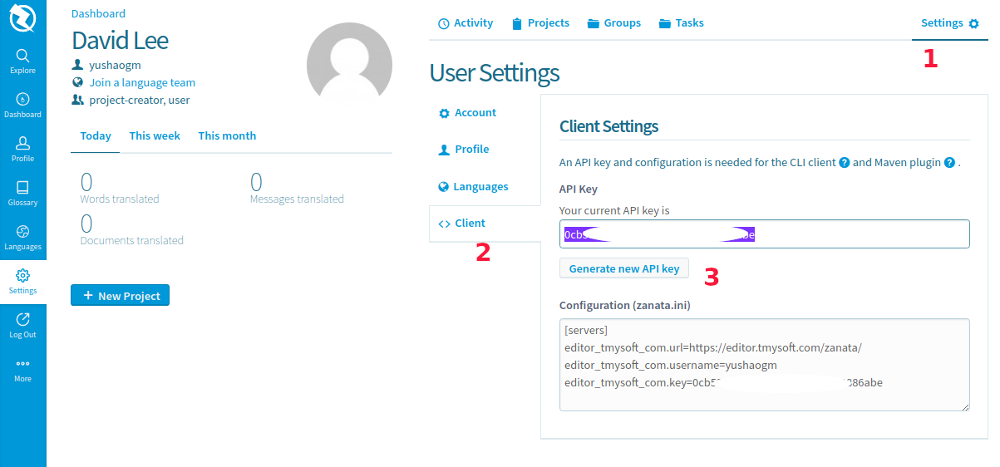</kbd>

Enter the username and API Key into TMY Wordpress setup page: username, token, project and version.

<kbd>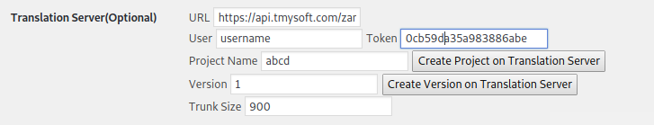</kbd>

## Pushing translation after Translation Server is configured(Premium Service)

Every time when button  is pressed, corresponding contents will be pushed to translation server.

## Translating with TMY Editor(Premium Service)

Visit `tmysoft.com` then `Editor` or `editor.tmysoft.com` directly.

<kbd>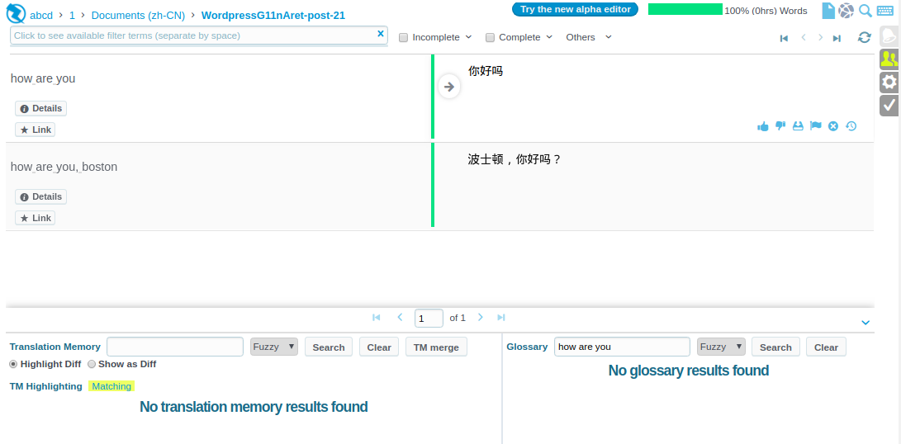</kbd>


## Using Google Translate to translate your post or pages(Premium Service)

Google Translate is fully integrated into tmysoft.com and TMY Web Editor, follow the page at [tmysoft.com/subscriptions.html](https://www.tmysoft.com/subscriptions.html) to start.

## Pulling translation from TMY Editor to your local Wordpress instance(Premium Service)

Visit TMY Dashboard page would automatically pull the finished translation from TMY Web Editor:

<kbd>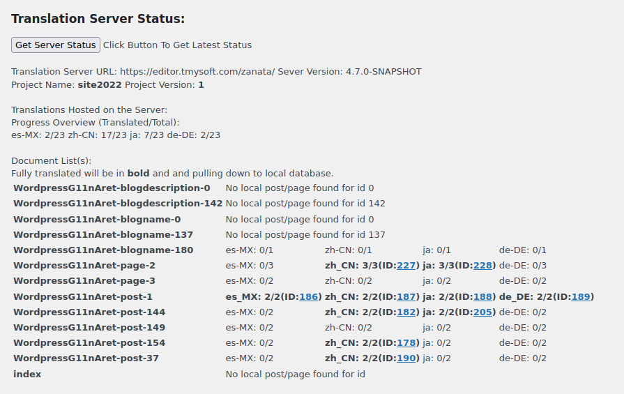</kbd>

## Enable Search Engine Optimization(SEO) URL

To use the SEO firednly URL, choose a non "Plain URL"  from Setting -> Permalinks page. Then come to TMY Glolalization -> TMY Setup page, choose "Yes" in SEO URL section.

<kbd>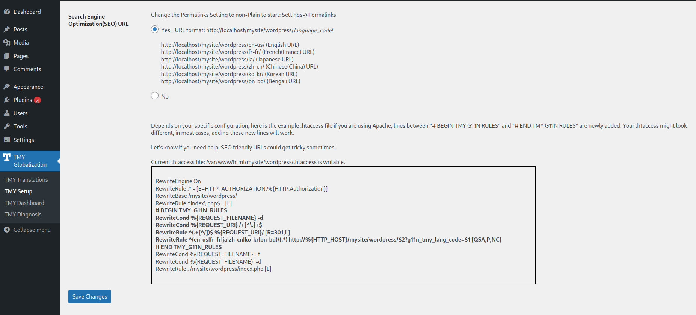</kbd>

Then, copy and paste the bold lines from the Setup page into your site's .htaccess file.

## To start developing TMY Wordpress Plugin

TMY Wordpress plugin is following open source license, look at code here:

[https://github.com/tmysoft/tmy-wordpress](https://github.com/tmysoft/tmy-wordpress)

Ask questions, submit PRs.

## There is no translation after I setup everything 

Make sure translation is enabled in TMY Setup page:

## The Wordpress site is not fully translated

Some of the translation are coming from the themem or the plugin, you will need to install the completed translation PO files and install it correctly. Reference here for more information:

https://developer.wordpress.org/plugins/internationalization/localization/

Or come to TMY online chat channel.

<kbd></kbd>

## TMY Plugin shows connecting error code 7 in Wordpress

On CentOS/Feodra Linux system, the error is mostly due to the SE Linux setting which blocks the network connection, using following command to change the SELinux setting:

```
# setsebool httpd_can_network_connect on
```


## Getting More Support

If you need further support, reach out to us at [tmysoft.com/subscriptions.html](https://www.tmysoft.com/subscriptions.html)
