# Translatio plugin for WordPress Getting Started & FAQ

----

Translatio is an open source tool for internationalization and localization of WordPress based websites. Translatio provides two translation workflows:

* Live translation workflow
* Full professional translation workflow

Live translation workflow provides instant translation based on the Google Translate engine. Simply configure the extra languages you want to support through the intuitive setup interface, save, and then you are done.

Full professional workflow provides more control and higher translation quality, which involves extracting the text, undertaking translation and integrating this back into WordPress. Translatio ensures you are always in control by hosting your translations locally for proof reading, editing and final publication. You can integrate machine translation of your choice to provide a foundation translation, then leverage the fully featured translation editor with any 3rd party translation agencies.

Translatio provides multiple ways to handle different development phases of your WordPress website, with intuitive and easy to use interfaces. 
Some features include:

* Live translation powered by Google Translate
* Full cycle to keep translation locally for proof read, edit and publish
* Support for the new block Gutenberg editor and classic editor
* Support for Google Translate integration with editing capability
* Language switcher options include:
  * Draggable floating menu
  * Sidebar widget
  * Along with title or description
  * With any page or post
* Display the language switcher in using the language name or country flag
* Auto-detect a visitors browser language setting and display your site in their language (if it is available, otherwise will display the site in the default language)
* Support for browser cookie settings
* Premium service available that provides you a professional translation editor and workflow, that syncs all translations back to your WordPress instance
* Live support community

----

## Install and activate Translatio

<kbd>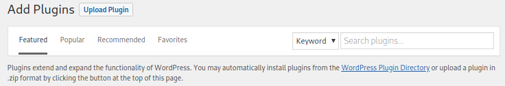</kbd>

Download the Translatio zip file from https://github.com/translatio-io/translatio/releases, e.g. translatio-globalization-1.0.0.zip 

Or, search for "Translatio" in the WordPress plugin directory and install it. After successful installation the Translatio main menu will appear in your WordPress Dashboard:

<kbd>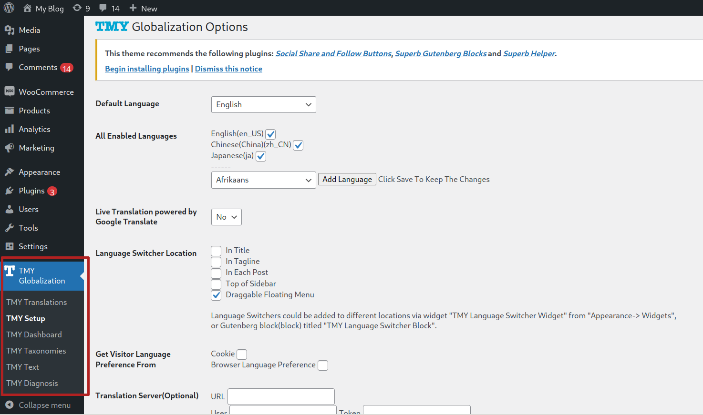</kbd>

You can then activate Translatio and begin translating.

## Configure Translatio for Live Translation workflow

From your WordPress dashboard side menu, select Translatio -> Translatio setup:

<kbd>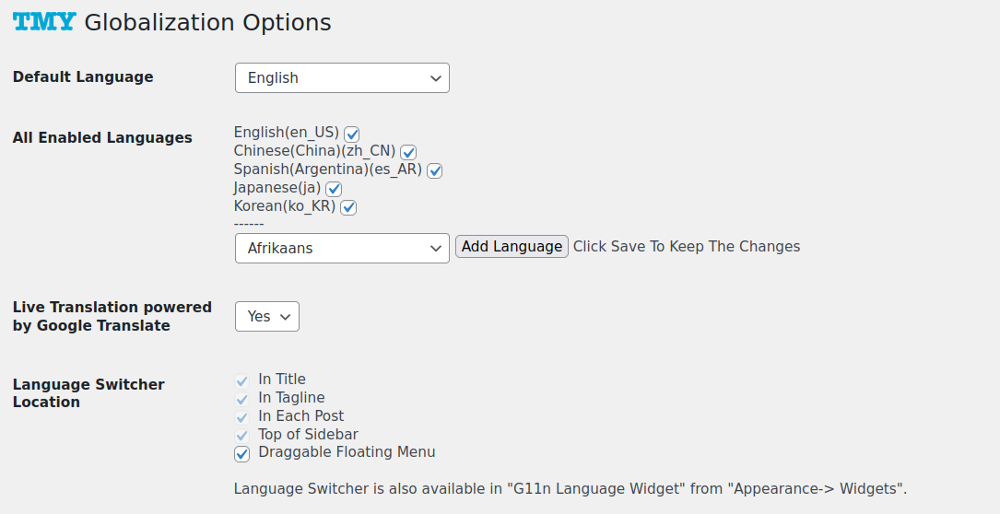</kbd>

Key configuration:
- Add the extra languages you want to support 
- Make sure the Live translation powered by Google Translate is set to "Yes"
- Make sure the Language Switcher location is set to "Draggable Floating Menu"

Press "Save Changes".

You can now visit your website, switching between languages to see how your website is being translated live.
<kbd></kbd>

## Configure Translatio for the Full Translation workflow

From the WordPress dashboard side menu, select Translatio -> Translatio setup:

<kbd>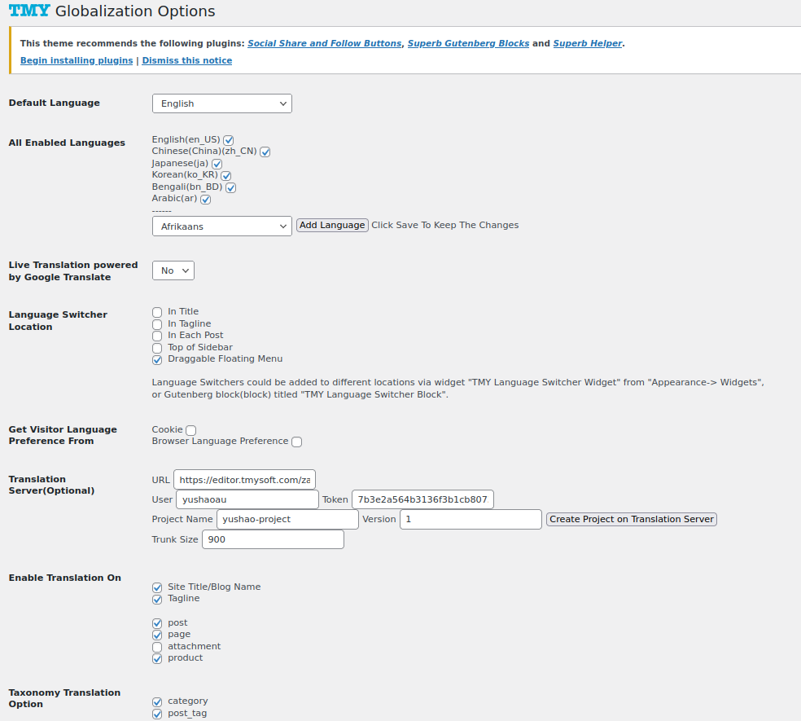</kbd>

Key configuration:
- Configure the additional enabled languages
- Enable translations on key properties you would like to translate: site title, tagline, posts and pages
- Select the Language Switcher location
- Choose if you would like the Language Switcher to display as text or country flags

Press "Save Changes".

## Use Translatio to translate a Post, Page or other Custom Type

In addition to the two main native document types "Page" and "Post", Translatio auto-detects any custom document build type you may have. For example, for WooCommerce, "product" is the main custom type. When visiting the Translatio Setup page, you will see "product" is listed. You can select all types you want to translate, and click save to continue. 

<kbd>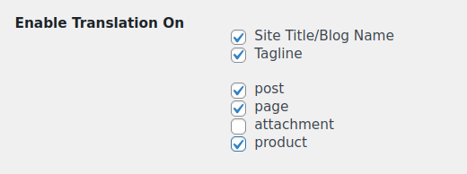</kbd>

There are two ways to start creating the translation page of a post or page.

### 1. From the main listing page of the Page of Post
From the Admin Main Menu select "Pages" or "Posts" (as in the following screenshot). Select the specific page or post you wish to translate, then select "Start or Sync translation" in the Bulk Action meanu, then click "Apply":

<kbd>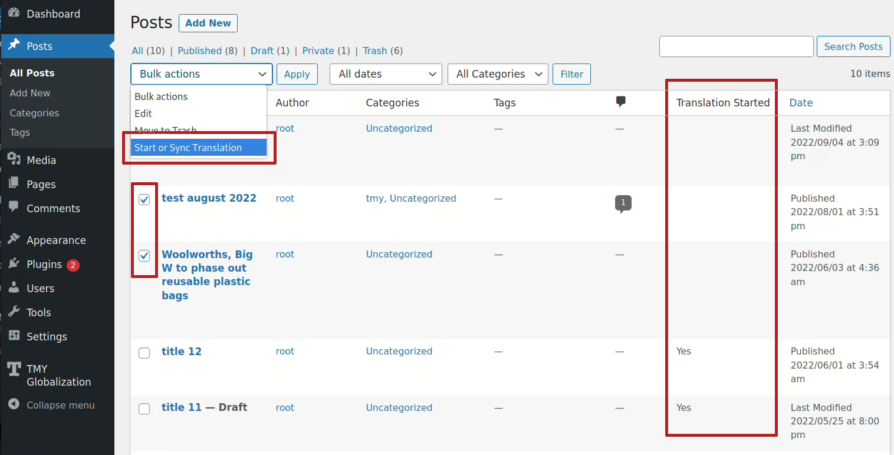</kbd>

You see which page or post has started translation in the "Translation Started" column.

### 2. From the Edit page of individual Page or Post

Log into the Admin panel of WordPress, navigate to the post page you want to translate, click the translate button 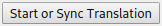

<kbd>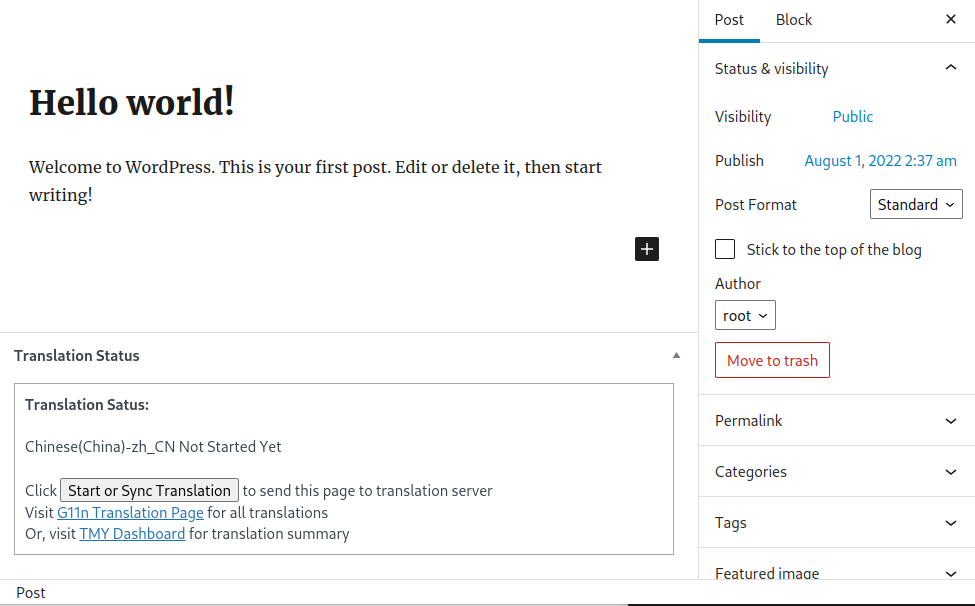</kbd>

Follow the information in the Translation Status box to get to the specific lanaguge translation page:

<kbd>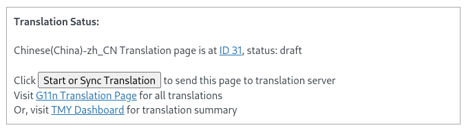</kbd>

Put the translation into the corresponding translation editor of the page or post, then Publish it. You will see a green LIVE button when your translation is live.

<kbd>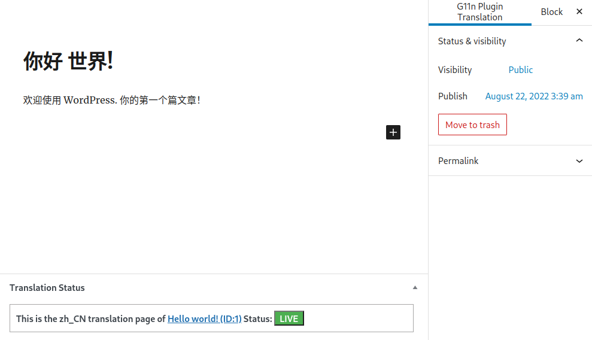</kbd>

## Use Translatio to translate the site title or tagline 

Site title is also called blogname at some places, similarly, tage line is often called blogdescription, and you can configure or change them at Setting -> General menu:

<kbd>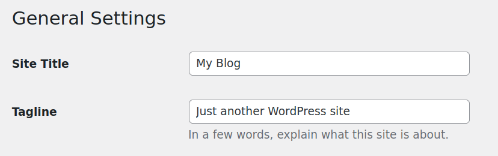</kbd>

To start translating them, enable the translation for them from Translatio -> Translatio Setup:

<kbd>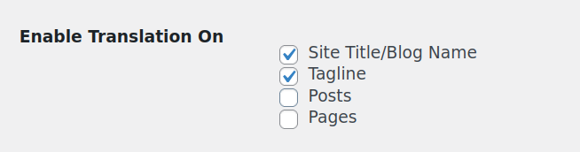</kbd>

Translatio will automatically create the place holder post corresponding to the blogname or blogdesription, the place holder post will be set as private. 

<kbd></kbd>

You can now follow the same processs as translating a page or post.

## Use Translatio For Taxonomies Translation(Categories, Tags, WooCommerces) 

Translatio will automatically detect all the taxonomy types including those from other themes or plugins, as shown in the following screen shots. You can enable translation for each as you need.

<kbd>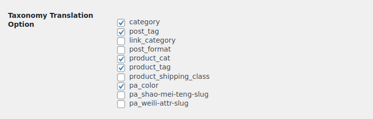</kbd>

Then visit Translatio -> Translatio Taxonomies, to start translation. You can use the bulk action option or use the invidual Catgeories or Tags page to start individual setup.

<kbd>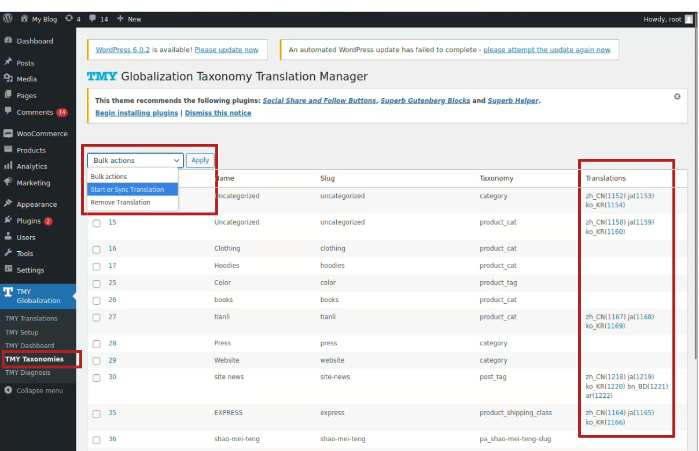</kbd>

You can now follow the same processs as translating a page or post.

## Translate Menu Labels and WooCommerce Product Attributes

Visit Translatio -> Translatio Text page. Translatio will then automatically identify all the menu labels and WooCommerce product attributes as shown in the following screenshot.

You can select the item or items, and use "Sync or Sync Translation" bulk acitons to start the translation process. Remember to keep the title(e.g. "Color" ) unchanged. 

<kbd>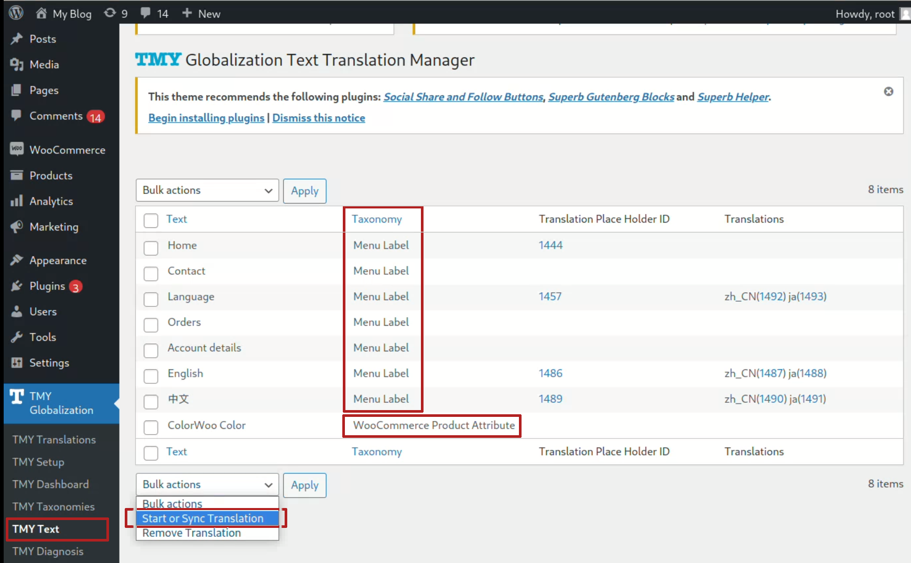</kbd>

Or you can create a private Post with the title being the same as the Product attribute, and then start translation as you would for a normal Post. Remember to keep it private, so it will not show up on your site. 

Translatio will automatically identify the translation following the string match("Color" to "Color") and use it for the WooCommerce product attribute translation.

<kbd>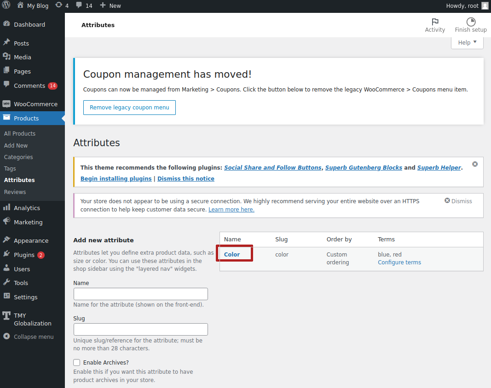</kbd>

<kbd>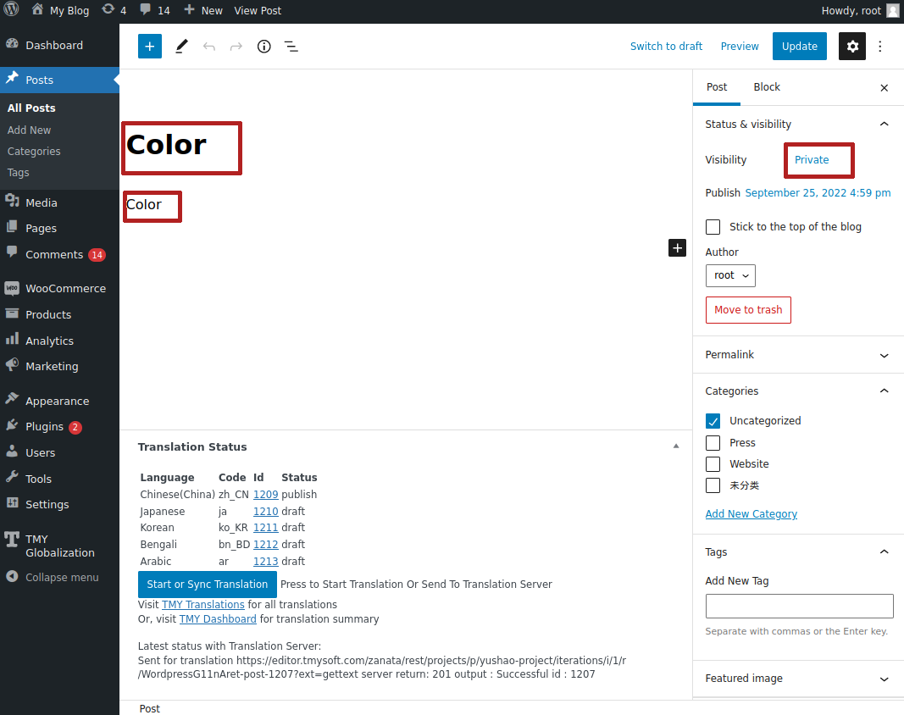</kbd>

## Translate Excerpt of Woo Commerce Product

Excerpt within the WooCommerce product is used as a brief introduction of the product. The following screenshot shows how to undertake trnslation of the Excerpt.

<kbd></kbd>

## Configure the Language Swither

Translatio provides multiple ways for you to allow visitors to switch between different languages:

- Translatio Language Switch Links for setting up Menus

  <kbd>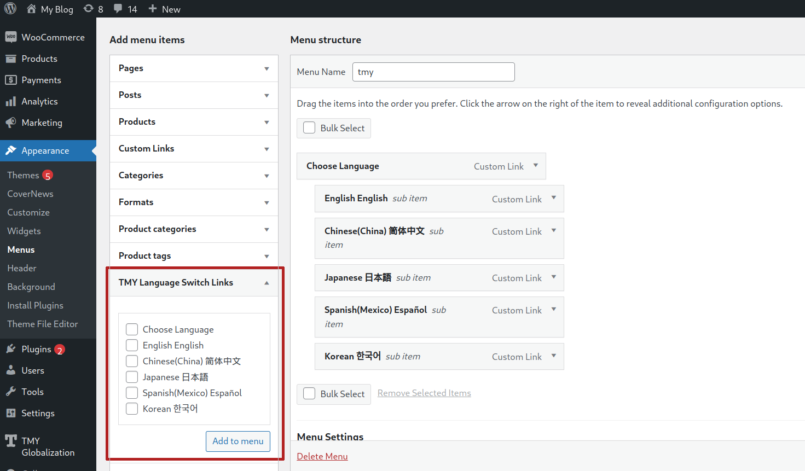</kbd>

  Somen menu links screenshots:

  <kbd>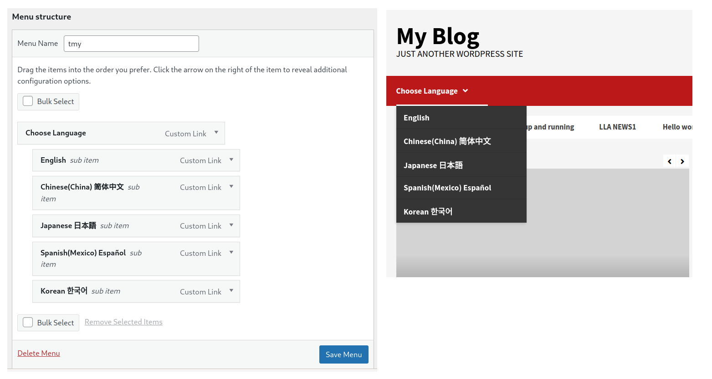</kbd>
  <kbd>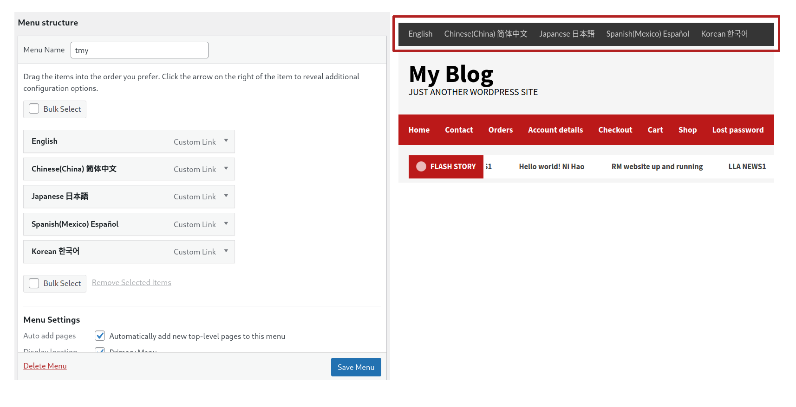</kbd>

- Translatio Language Switcher Block

  <kbd>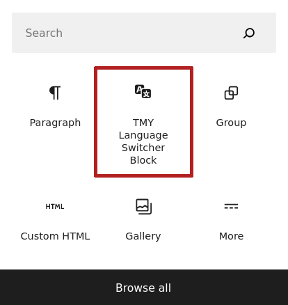</kbd>


- Translatio Language Switcher Widget

  <kbd>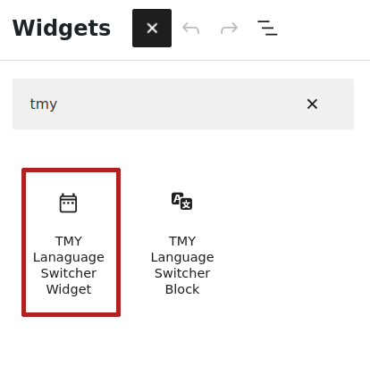</kbd>

The Language Switcher can be placed at one of the predefined locations, set in Translatio within Translatio Setup. 
You can choose from:
1. In Title
2. In Tagline
3. Top of Sidebar
4. In Each Post
5. Draggable Floating Menu 

Here is a reference:

<kbd>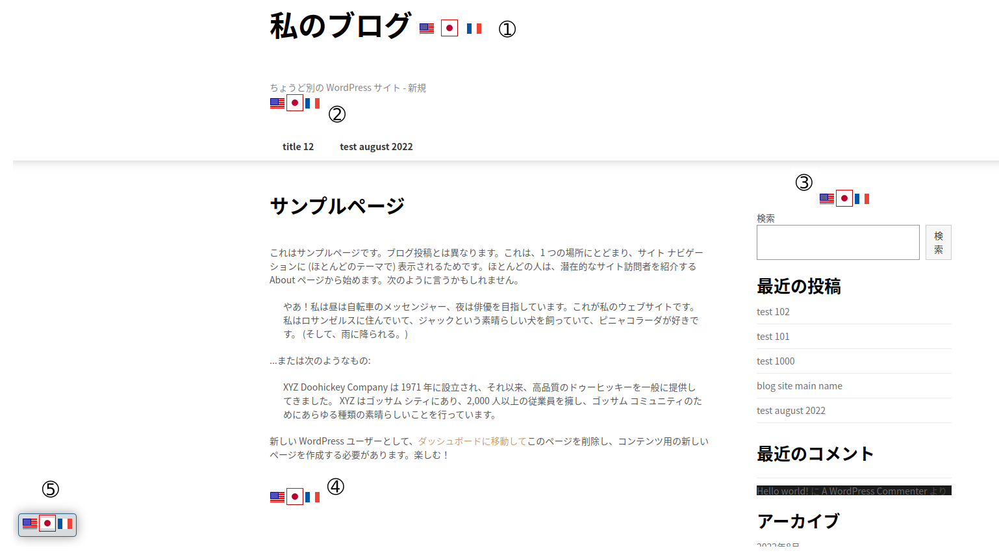</kbd>

## Using "Translatio Translatiaon" & "Translatio Dashboard"

"Translatio Translation" page lists all the local translations.
It lists:
- Title
- ID, the post id of the translation 
- Lanaguge
- Original ID, the post id of the original post/pages
- Translation Status, is the translation live viewable publicly
- Date, Last modified time

<kbd>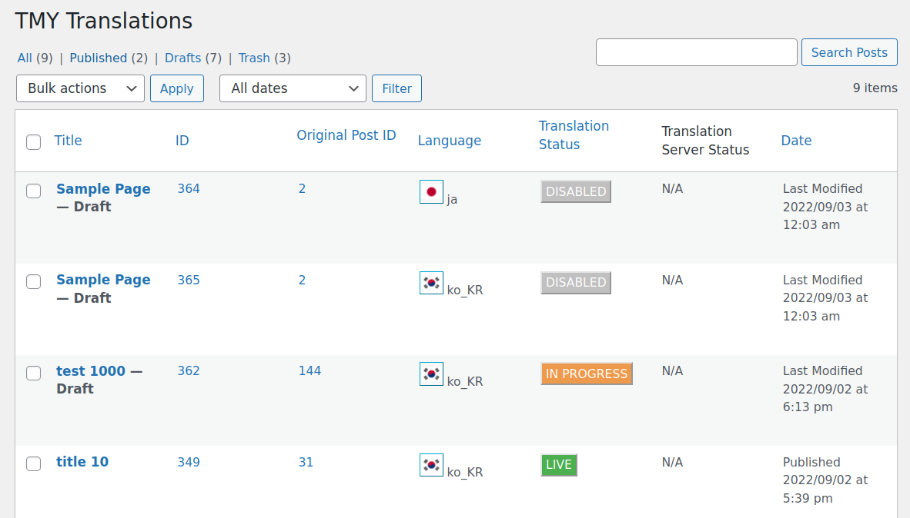</kbd>

"Translatio Dashboard" provides a centralized place to pull translations from the translation server.


## Using Translatio's Premium Service

Translatio Premium is designed to help you translate much easier than is possible within the WordPress interface. When the translation server is configured, contents will be pushed to the Translatio translation server and editor automatically. Machine automated translation is also provided for much easier integration. This diagram illustrates the workflow differences between the free and premium services.

<kbd>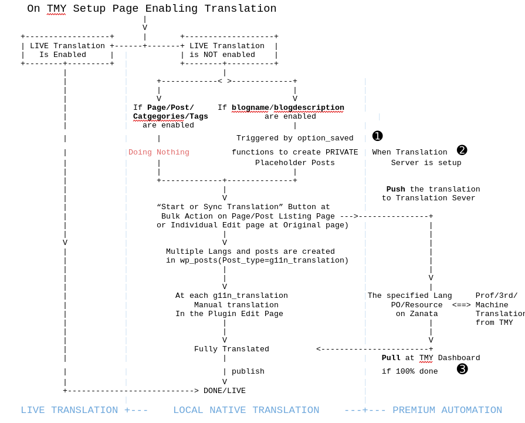</kbd>

## Configuration and use of the Translatio Premium Editor(Premium Service)

First, register with translatio.io, log into the Translatio Web Editor and generate your personal API key. Create the project and version of your project.

<kbd>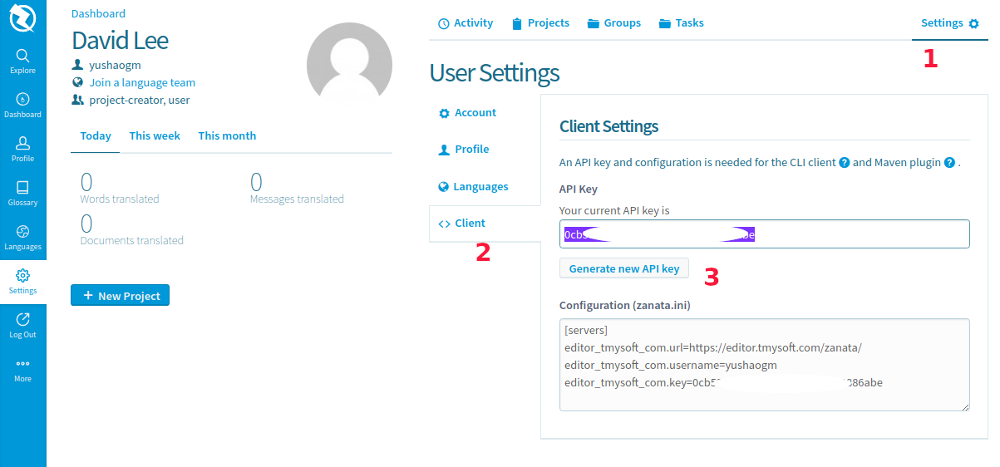</kbd>

Enter the username and API Key into the Translatio WordPress setup page: username, token, project and version.

<kbd></kbd>

## Pushing translation after the Translation Server is configured(Premium Service)

Now, every time you press the  button, corresponding contents will be pushed to the Translatio translation server.

## Translating with the Translatio Editor(Premium Service)

Visit `translatio.io` then `Editor` or `editor.translatio.io` directly.

<kbd></kbd>


## Using Google Translate to translate your post or pages(Premium Service)

Google Translate is fully integrated into translatio.io and the Translatio Web Editor. Visit the page at [translatio.io](https://www.translatio.io) to start.

## Pulling translation from the Translatio Editor to your local WordPress instance(Premium Service)

The Translatio Dashboard page automatically pulls in the finished translation from the Translatio Web Editor:

<kbd>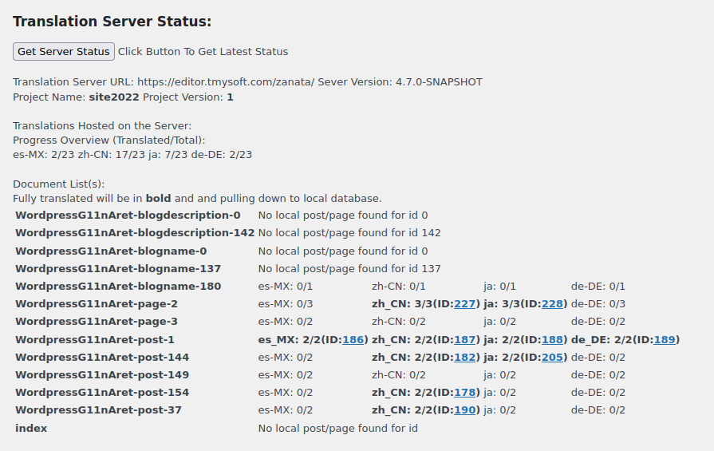</kbd>

## Enable Search Engine Optimization(SEO) URL

To use the SEO firednly URL, choose a non "Plain URL"  from Setting -> Permalinks page. Then come to Translatio -> Translatio Setup page, and choose "Yes" in the SEO URL section.

<kbd>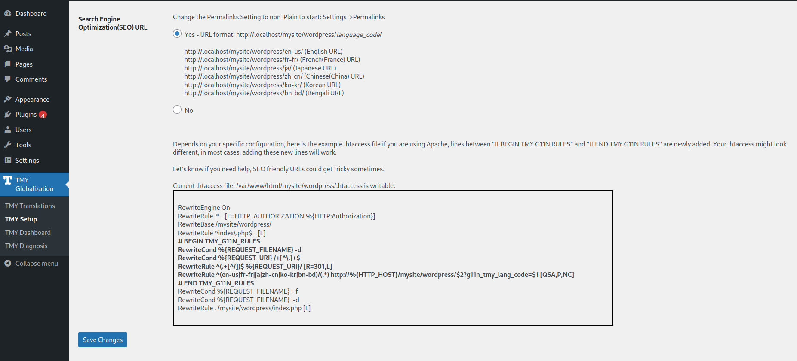</kbd>

Finally, copy and paste the bold lines from the Setup page into your site's .htaccess file.

## To start developing using the Translatio WordPress Plugin

Translatio is an open source project and utilises an open source license. You can look at the code here:

[https://github.com/translatio-io/translatio](https://github.com/translatio-io/translatio)

Ask any questions, and feel free to submit a PR.

## There is no translation after I setup everything 

Make sure translation is enabled in the Translatio Setup page:

## The WordPress site is not fully translated

Some of the content may be coming from the theme or a separate plugin. You will need to find the completed translation PO files and install them correctly. Reference here for more information:

https://developer.wordpress.org/plugins/internationalization/localization/

Or come to our Translatio online chat channel.

<kbd></kbd>

## Translatio shows connecting error code 7 in WordPress

On CentOS/Feodra Linux system, the error is mostly due to the SE Linux setting which blocks the network connection. You can use the following command to change the SELinux setting:

```
# setsebool httpd_can_network_connect on
```


## Getting More Support

If you need further support, reach out to us at [translatio.io](https://www.translatio.io)
